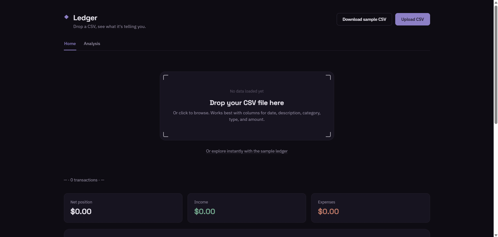

# Ledger

This is a CSV-in, insight-out financial analysis tool. Drop in a transaction export from a bank, a spreadsheet, or a payment processor, and it turns the raw rows into a full picture: net position, income vs. expenses, category breakdowns, a monthly trend, and a searchable, sortable transaction table.

**[Live Demo](https://crypticot.github.io/ledger-data-explorer/)**



---

## Why this exists

Most people's financial data lives in whatever CSV export their bank happens to produce, and every bank formats that export slightly differently. Date order varies, column names vary, some exports have a Type column and some just use a negative number, and there's rarely a way to tell if the file loaded correctly before you're already looking at a chart built from misread numbers.

This tool treats the upload itself as the part worth getting right. Before any chart renders, you see a side-by-side of your raw values against how they were interpreted, with anything that failed to parse listed explicitly. Nothing reaches the analysis page until you can see it was read correctly.

It also assumes the file never needs to leave your browser. There's no server in this tool, no account, nothing to upload to. The CSV is parsed and charted entirely client-side.

---

## What it does

- **Upload and validate**: drop a CSV or click to browse; a preview shows raw values next to their interpreted date, description, category, type, and amount, with any unparseable rows listed by issue so you can fix and re-upload before proceeding
- **Flexible date parsing**: reads ISO dates, and for ambiguous formats like `03/04/2024`, scans the whole file for a value that could only be day-first or month-first (like a day above 12) to infer which convention your file uses, rather than guessing row by row
- **Type inference**: if your file has no Type column, the sign of the amount decides whether a row counts as income or an expense
- **Dashboard**: net position with a cumulative trend line, income, expenses, transaction count, and average transaction size, all recalculated live against whatever filters are active
- **Monthly flow chart**: income and expenses charted month over month
- **Category donuts**: separate breakdowns for where expenses go and where income comes from; click a slice or its legend row to filter the whole page down to that category, select more than one at once, and clear the filter from a pill that appears while it's active
- **Year and month filters**: built from whatever's actually in your data, each one narrowing the other to combinations that exist, reshaping every chart and the table beneath it
- **Currency display**: switch the symbol shown across the page between a dozen common currencies or type a custom 3-letter code; this relabels amounts only; there's no live exchange rate converting the underlying numbers
- **Transactions table**: search by description or category, filter by Income/Expense with chip buttons, and Excel-style multi-column sorting, click a header to sort, click again to flip direction, a third click clears it, and sorting a second column adds it as a tiebreaker with a priority number shown on each active header
- **Sample data**: a one-click sample ledger to explore the tool instantly, and a downloadable sample CSV showing the expected format
- **Help accordion**: covers the expected CSV format, what happens right after upload, how the filters and category selection work, how currency display works, how table sorting works, and a straight answer on data privacy

---

## Tech stack

Built entirely in vanilla HTML, CSS, and JavaScript. Just open `index.html`.

- [Chart.js](https://www.chartjs.org/): the cumulative trend, monthly flow, and category donut charts
- Google Fonts: Space Grotesk (headings) + IBM Plex Sans (body)

---

## Running it locally

```bash
git clone https://github.com/crypticot/ledger-data-explorer.git
cd ledger-data-explorer
```

Open `index.html` in any browser. No dependencies to install, no server required.

---

## A few design decisions worth knowing

**Why the validation preview exists before the real dashboard.** A misread date or a column the parser didn't recognize is a lot easier to notice in a five-row comparison table than buried inside a chart that just looks slightly wrong. Gating "View full analysis" behind a clean validation pass means you never build conclusions on top of a parsing mistake without knowing it happened.

**Why date convention is detected from the whole file, not guessed per row.** A single date like `03/04/2024` is genuinely ambiguous on its own. But if anywhere else in the same file a date shows a day above 12, that tells you the file's convention, and every date should be read the same way for consistency. Scanning the full file first, then applying one convention throughout, avoids the file being read as partly day-first and partly month-first.

**Why currency switching doesn't convert anything.** Adding real conversion means depending on a live exchange rate API, which means the tool stops working offline and stops being "nothing leaves your browser." Relabeling the symbol covers the common case, someone wants to see their numbers with a different currency sign, without quietly implying an accuracy the tool can't back up.

**Why category filtering supports multiple selections instead of one at a time.** Comparing "Software Subscriptions plus Contractor Fees" against everything else is a real question, and forcing a single-category filter would mean losing that comparison entirely. Letting selections stack, with a visible pill and an easy way to clear them, keeps the common single-category case just as simple while not blocking the multi-category one.

---

## Built by

**Chidubem Ojukwu** · [Portfolio](https://crypticot.github.io/cotworks-portfolio/) · [LinkedIn](https://linkedin.com/in/ojukwuii)

Built as part of a learning project, and exists independently as a tool for anyone who wants a quick read on a CSV of transactions without uploading it anywhere.
